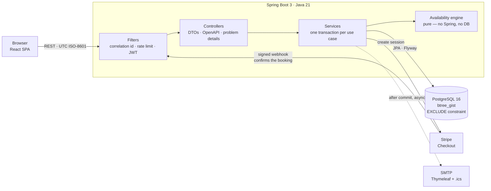

# SlotFlow — Multi-Tenant Appointment & Booking Platform

[](https://github.com/houssamtouaj/appointment_booking/actions/workflows/ci.yml)

**Any service business — clinic, salon, tutor, coach, studio — defines its availability rules
once and takes online appointments with deposit payments. Multi-tenant, with double booking
made impossible by the database rather than by careful code.**

<!-- DEPLOY: replace the two placeholders below once the blueprint in ./render.yaml has been
     applied. They are the first thing a reader looks at, so leaving them wrong is worse than
     leaving them empty. -->

| | |
|---|---|
| **Live demo** | _not deployed yet_ — `render.yaml` is the blueprint; see [Deploying](#deploying) |
| **Demo admin** | `demo@slotflow.app` / `demo1234` — or press **Log in as demo admin**, no typing |
| **Swagger UI** | `<demo-url>/swagger-ui.html` |
| **Health** | `<demo-url>/actuator/health` |

The demo tenant is a Paris salon with three staff, six services and about forty appointments
across the last three weeks and the next two. Everything in it is generated relative to the
current date at startup, so it is never stale, and it is rebuilt from the seeder on any empty
database — nothing a visitor does to it is permanent.

> **On cold starts.** Render's free web tier idles after fifteen minutes and takes roughly
> thirty seconds to answer the first request after that. `render.yaml` therefore asks for the
> paid `starter` plan, which does not idle. If the demo is running on the free tier instead,
> that first request is slow and the API is not — this note exists so a reviewer does not have
> to guess which.

<!-- DEPLOY: a GIF of the booking flow belongs here — pick a service, pick a staff member,
     pick a slot, pay the deposit in Stripe test mode, see the confirmation. Under 15 seconds. -->

---

## The problem

Availability looks like a calendar lookup and is not one. A bookable slot is what survives a
chain of subtractions: the staff member's weekly template for that weekday, minus holidays and
one-off blocks, plus the occasional extra evening, minus every existing appointment — each of
those widened by the setup and cleanup time the service needs but never charges for. Only then
is the remaining time walked in fifteen-minute steps, keeping the starts where the whole
appointment still fits, and finally trimmed by policy: not within two hours, not beyond sixty
days. A 90-minute colour with quarter-hour buffers either side costs the calendar two hours, and
a booking that lands inside somebody else's cleanup buffer is a double booking that no naive
overlap check sees.

Then two people click the same slot at the same moment. Whatever the engine computed, the honest
answer has to come from the database — so the guarantee here is a Postgres exclusion constraint
over the buffer-expanded range, not an application check. The application check remains, as an
optimisation that produces a good error message; it is not what makes the promise true. Add the
timezone dimension — "we open at nine" stays true across a DST change, so working hours are
wall-clock times interpreted in the business's zone while every instant on the wire is UTC — and
the interesting parts of this project are all in the same place: the engine, the constraint, and
the tests that pin them.

## Architecture



Two things in that picture are load-bearing. The **engine is a pure function** — it takes working
hours, overrides, existing bookings and a policy, and returns slots; it has no Spring context and
no database, which is why its DST, midnight-crossing and buffer cases are unit tests that run in
milliseconds. And a booking is confirmed **by the webhook, never by the browser**: the browser
reporting a successful payment is a claim, and a signed webhook is proof.

## Notable engineering decisions

**The exclusion constraint covers buffers, not the appointment.** `booking` stores
`blocked_from`/`blocked_to` — the appointment widened by the buffers snapshotted onto the row —
and `EXCLUDE USING gist (staff_id WITH =, tstzrange(blocked_from, blocked_to) WITH &&) WHERE
(status IN ('PENDING','CONFIRMED'))` ranges over those. A constraint over the raw appointment
would accept a booking landing inside another's cleanup buffer: a row the engine would never have
offered, so the database would be enforcing a different rule from the application. The `WHERE`
clause is what makes a cancelled slot immediately rebookable.

**Refresh-token rotation with reuse detection.** Refresh tokens are 256 random bits, stored only
as a SHA-256 hash, and single use: presenting one revokes it and issues a successor linked to it.
Presenting an already-rotated token is therefore not an error, it is evidence — the chain is
treated as stolen and every session that user holds is revoked, with `401 REFRESH_REUSED`. The
token travels in an `HttpOnly` cookie scoped to `/api/auth`, `SameSite=Lax` wherever the SPA and
the API share a domain — which is also the whole CSRF answer, since no other endpoint accepts a
cookie for anything. Splitting them across Vercel and Render makes every call cross-site, where a
Lax cookie is simply never sent, so that deployment sets `SameSite=None; Secure` and accepts the
one residual: another origin can force a rotation or a logout it has no way to read.

**Tenant isolation comes from the token, and reads answer 404.** Every admin query is filtered by
the `business_id` in the access token — never from a path or query parameter, so there is no
parameter to tamper with. A cross-tenant *read* returns `404`, because `403` would confirm the row
exists and turn the endpoint into an existence oracle; a cross-tenant *write* returns `403`,
because the caller is authenticated and being refused. Every admin endpoint inherits both
assertions from one test harness, each paired with the same call inside the caller's own tenant —
without that control, a typo in a path answers 404 for everyone and the security test passes
forever while testing nothing.

**UTC at rest and on the wire; the business timezone frames the day.** `timestamptz` columns,
`Instant` in Java, ISO-8601 out. Working hours are `LocalTime`, deliberately: "we open at nine" is
a wall-clock statement that survives a DST change, and storing an instant would open the salon an
hour early every summer. The engine materialises those into instants per date in the *business's*
zone, and the `?tz=` parameter decides only where a caller's day boundaries fall.

**Bookings snapshot their terms.** `price_cents` and both buffers are copied from the service at
creation. Re-pricing a service must not rewrite what past customers were charged, and it must not
silently move the blocked range the exclusion constraint is enforcing — the snapshot is what makes
that range computable at all.

**No password hash inside a transaction.** BCrypt at cost 12 is a quarter of a second of
deliberate key stretching, and Hibernate holds its JDBC connection for the whole transaction. So
hashing inside `@Transactional` parks a pooled connection doing nothing on every sign-in, which
with ten connections caps logins near forty a second and lets a burst starve unrelated requests.
Every auth use case here is: look up, end the transaction, hash, then a short transaction for the
writes.

**Login is not an enumeration oracle.** An unknown address, a wrong password and a deactivated
account return a byte-identical body, and `login` performs exactly one BCrypt verification on
every path — against a real hash of a random value when there is no user — so the timing does not
answer what the body refuses to. Registration deliberately does *not* hide `EMAIL_TAKEN`, because
the sign-up form has to say which field to change; that trade is written down where it is made,
along with what closing it would require.

**Time is injected everywhere.** `Clock.systemUTC()` appears in exactly one bean, and a direct
`Instant.now()` anywhere else is a review blocker rather than a style note. That is what makes a
DST test a one-liner — and it is enforced by a test that scans the whole of `src/test` for
`Thread.sleep` and for wall-clock reads, because a rule enforced by review is enforced until the
afternoon somebody is in a hurry.

## Tech stack

| | |
|---|---|
| Language / runtime | Java 21, Spring Boot 3.5 |
| Persistence | PostgreSQL 16 (`btree_gist`), Spring Data JPA, Flyway |
| Auth | JWT access tokens (15 min) + rotating refresh cookie (7 days), BCrypt cost 12 |
| Payments | Stripe Checkout, test mode; bookings confirmed by signed webhook |
| Email | Spring Mail + Thymeleaf templates with `.ics` attachments; MailHog locally |
| Mapping / boilerplate | MapStruct (`unmappedTargetPolicy = ERROR`), Lombok |
| Rate limiting | Bucket4j, in-memory, per IP and per guest email |
| API docs | springdoc-openapi → Swagger UI |
| Tests | JUnit 5, Testcontainers, MockMvc + spring-security-test, JaCoCo |
| Formatting | Spotless + the Eclipse formatter, checked at `validate` so it fails in seconds |
| CI | GitHub Actions — `mvn -B verify` on every push and PR |
| Frontend | React 18 + TypeScript + Vite (separate deployable) |

## Running it locally

```bash
cp .env.example .env      # placeholders are fine for local work
docker compose up         # postgres + mailhog + api, seeded
```

That is the whole setup. The API comes up on the `demo` profile, so the database is seeded and
`demo@slotflow.app` / `demo1234` works immediately.

| | |
|---|---|
| Swagger UI | <http://localhost:8080/swagger-ui.html> |
| Health | <http://localhost:8080/actuator/health> |
| MailHog — every outbound email | <http://localhost:8025> |
| Postgres | `localhost:5432`, credentials from `.env` |

Set `SPRING_PROFILES_ACTIVE=` (empty) in `.env` for a bare instance with no demo data. Payments
are off by default, so the stack works with no Stripe account at all; every booking is then
created `CONFIRMED`. To exercise the deposit flow, put a test-mode key in `.env`, set
`PAYMENTS_ENABLED=true`, and run:

```bash
stripe listen --forward-to localhost:8080/api/webhooks/stripe
```

`.env.example` documents every variable the application reads — and a test asserts that it does,
because an undocumented default is discovered by whoever deploys next, as a feature that is
mysteriously off with nothing anywhere naming the variable that would turn it on.

To run the app on the host against the Compose services instead, use the `local` profile:

```bash
set -a; . ./.env; set +a
cd backend && ./mvnw spring-boot:run -Dspring-boot.run.profiles=local
```

## Tests

```bash
cd backend
./mvnw verify                        # everything; needs Docker running
./mvnw test                          # unit and web-slice only, no Docker
./mvnw verify -Dit.test=BookingConcurrencyIT
```

**678 tests — 341 unit and web-slice, 337 integration — in about four minutes, on one Postgres
container for the whole integration suite.** That last point is a decision rather than a detail: handing the container's lifecycle to
JUnit starts and stops it once per test class, which turns a forty-second suite into an
eight-minute one and nothing fails to tell you. It is started once per JVM instead, and every test
creates its own tenant and asserts only on rows it inserted — so the suite is correct whether or
not container reuse is enabled, which matters because reuse is ignored in CI.

| Layer | Tool | What lives there |
|---|---|---|
| Pure unit | JUnit 5, no Spring | the availability engine, `TimeWindow`, the booking state machine, deposit rounding |
| Web slice | `@WebMvcTest` + spring-security-test | status codes, validation bodies, problem-detail shapes |
| Integration | `@SpringBootTest` + Testcontainers | migrations, the exclusion constraint, tenant isolation, concurrency, email |

Coverage is gated where it means something and nowhere else: **90 % branch coverage on
`com.slotflow.availability.domain` and `com.slotflow.booking`**, with no project-wide threshold —
a global number is met by testing getters, and this build would rather fail on the engine than on
a DTO. The engine itself is at **100 %** branch coverage and the booking package at **92.5 %**;
project-wide branch coverage is **82.8 %**, reported here rather than enforced. A test asserts that
both package names still exist, because a JaCoCo rule naming a package that no longer matches
anything is not a failure: it is simply no longer checked.

Formatting is the build's problem, not yours: `./mvnw spotless:apply` fixes whatever the gate
reports. It runs at `validate`, so a mis-indented line fails in about five seconds rather than
after the tests. The rules live in `backend/eclipse-formatter.xml`, and the two that matter are
that it never re-joins a line you split and never reflows a comment.

Two claims the suite proves rather than asserts in prose. **No double booking:** two threads
aligned on a `CountDownLatch` race for one slot, and the assertion is on the outcome pair — one
`201`, one `409` — not on which thread won. **Correct availability:** the DST transition, the
midnight-crossing shift, the split shift, and the buffer that blocks a slot the appointment itself
never touches each have a named test.

## Deploying

`render.yaml` in the repository root is a Render blueprint: managed Postgres, Flyway on boot, the
`demo` profile, a generated `JWT_SECRET`, and the health check wired to the platform probe so a
wedged instance restarts on its own. Nothing secret is in it — the values that are get
`sync: false`, meaning "ask in the dashboard, never store in git".

Three steps it cannot do for you:

1. **`DB_URL`.** Render exposes a database's host, port and user to a service but not a JDBC URL,
   and a blueprint cannot interpolate one. Paste it once:
   `jdbc:postgresql://<internal-host>:5432/<database>`.
2. **The Stripe webhook**, which has to be created against the deployed URL and so cannot exist
   before the first deploy. Use the test-mode signing secret.
3. **`CORS_ALLOWED_ORIGINS`**, once the frontend has an origin: the Vercel origin plus
   `http://localhost:5173`, comma-separated. Never `*` — the refresh cookie means this API sends
   `Access-Control-Allow-Credentials`, with which a wildcard origin is illegal, and the
   application refuses one at startup rather than failing every preflight afterwards.

**Backups** are whatever the free tier offers, plus the fact that the demo can be rebuilt from the
seeder on any empty database. That is the honest answer for a demo, and it is why the seeder is
idempotent rather than a one-shot migration.

## Repository layout

The backend and frontend are independent deployables that share nothing but the HTTP contract the
OpenAPI document describes.

```
Appointment_booking/
├── backend/          Spring Boot 3 / Java 21 REST API      → Render (render.yaml)
├── frontend/         React 18 + TypeScript + Vite SPA      → Vercel
├── docs/             brief, UML and the sixteen build plans (not committed)
├── docker-compose.yml — api, postgres, mailhog
└── render.yaml        — the deployment blueprint
```

Keeping the SPA a pure consumer of a documented REST API means the engine, the tenant guard and
the double-booking constraint can be tested and deployed on their own — and it makes the boundary
obvious to anyone reading the repository.

## Possible extensions

Out of scope for this build, and deliberately so:

- **Refunds.** Deposits are non-refundable today, and the API says so in the booking response
  (`depositRefundable: false`) rather than leaving a customer to find out.
- **Recurring appointments**, which need a series entity and a decision about what "cancel" means.
- **Customer accounts.** Every booking is a guest booking keyed by a cancellation token; the
  `CUSTOMER` role was cut because the brief had no screen for it.
- **SMS reminders**, and a real outbox: notifications are published after commit and sent
  asynchronously, but a dead relay currently loses the message rather than retrying it.
- **Multi-business identity.** Email addresses are globally unique, so one person cannot own two
  businesses.
- **Rate limiting across instances.** The Bucket4j buckets are in-memory, so the budgets are per
  instance; a Redis store would change the wiring and nothing else.
